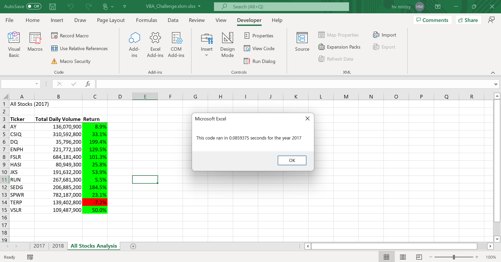
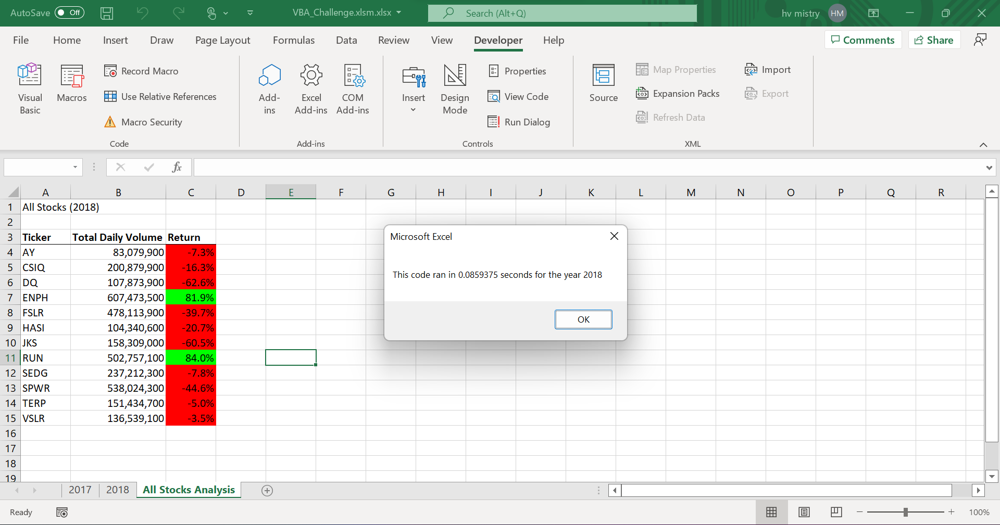

# stock-analysis
Performing analysis of financial stock data to make financial decisions
# Stock Analysis
## Overview of Project
In this section, you will find the background and purpose of the project.
### Background of Project
Steve is preparing a worksheet that can do a complete analysis of stocks for year 2017 and 2018 which will help his parents to take decision about investing his money in particular stocks.
### Purpose
Purpose of this project analysis to help Steve's parents to make decision about investing in stock market by examining past stock data. This extended analysis is to perform analysis of large data set by refactoring/editing the code which will smoothen analysis process.
## Results
In this section, we will compare and analysis stock performance for 2017 and 2018 along with how code refactoring/editing helped analysis.
 
In year 2017, Return was quite positive for all stocks in which DQ has performed extraordinarily well by resulting in 199.4%, only the stock TERP noted a negative return of 7.2% in comparison with 2018.

While, in contrast, 2018 showed positive results for just two stockts i.e. ENPH - 81.9% & RUN - 84.0%. Rest of all other stocks had negative results in which Stock SPWR noted with much loss in 2018. 

Talking about execution time of original greenstock_analysis script corresponding to VBA_analysis for both years 2017 and 2018, run time proved a significant difference of around 75,826.4828 seconds for 2017. While in 2018, original script had 75960.38 seconds run time and on the other side, VBA updated script had 0.0859375 seconds. 
### Summary
1. What are the advantages or disadvantages of refactoring code?
After refactoring, code becomes easier to understand and took less time to run it. Less complexity and smoothing the process is the main pros of refactoring the code. If rectoring does not run as per plan, then it can become risky and create more issues of bugs.
